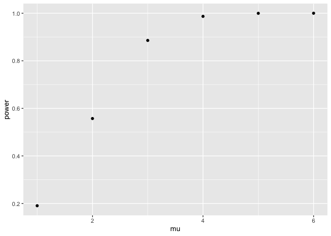

Homework 5: Iteration
================
Kimberly Lopez
2024-11-06

``` r
library(tidyverse)
```

    ## ── Attaching core tidyverse packages ──────────────────────── tidyverse 2.0.0 ──
    ## ✔ dplyr     1.1.4     ✔ readr     2.1.5
    ## ✔ forcats   1.0.0     ✔ stringr   1.5.1
    ## ✔ ggplot2   3.5.1     ✔ tibble    3.2.1
    ## ✔ lubridate 1.9.3     ✔ tidyr     1.3.1
    ## ✔ purrr     1.0.2     
    ## ── Conflicts ────────────────────────────────────────── tidyverse_conflicts() ──
    ## ✖ dplyr::filter() masks stats::filter()
    ## ✖ dplyr::lag()    masks stats::lag()
    ## ℹ Use the conflicted package (<http://conflicted.r-lib.org/>) to force all conflicts to become errors

``` r
library(rvest)
```

    ## 
    ## Attaching package: 'rvest'
    ## 
    ## The following object is masked from 'package:readr':
    ## 
    ##     guess_encoding

``` r
library(broom)
library(dplyr)
```

``` r
set.seed(5)
```

# Problem 1

# Problem 2

For one randomly generated sample of n=30, with mean = 0, and sd= 5, run
a t.test() and return the estimate & p-value:

``` r
sim_data = 
    tibble(
    x = rnorm (30, mean= 0, sd= 5))

t.test(sim_data)|>
  broom::tidy()|>
  select(estimate,p.value)
```

    ## # A tibble: 1 × 2
    ##   estimate p.value
    ##      <dbl>   <dbl>
    ## 1   0.0565   0.951

Function for performing a one-sample t-test and returning the estimate &
p-value:

``` r
sim_t_test = function ( n , mu= 0, sigma =5) {
  
  sim_data = 
    tibble(
    x = rnorm (n, mean= mu, sd= sigma))
  
  sim_data|>
    t.test()|>
    broom::tidy()|>
    select(estimate, p.value)
  
}

sim_t_test(n=30)
```

    ## # A tibble: 1 × 2
    ##   estimate p.value
    ##      <dbl>   <dbl>
    ## 1    0.794   0.415

For 5000 datasets: when mu=1

``` r
output = vector("list", 5000)

for (i in 1:5000) {
  output[[i]] = sim_t_test(n=30)
}

sim_results_mu1 = bind_rows(output)

sim_results_mu1
```

    ## # A tibble: 5,000 × 2
    ##    estimate p.value
    ##       <dbl>   <dbl>
    ##  1  -0.584   0.471 
    ##  2   0.396   0.686 
    ##  3  -0.416   0.667 
    ##  4  -0.0730  0.941 
    ##  5   1.03    0.158 
    ##  6   0.0726  0.946 
    ##  7  -1.11    0.204 
    ##  8   0.609   0.443 
    ##  9   0.370   0.684 
    ## 10  -2.04    0.0533
    ## # ℹ 4,990 more rows

Function for calculating power: known as the proportion of times the
null was rejected

- Use after binding all simulations

``` r
sim_power = function ( data) {
  
  data|>
   filter(p.value < 0.05) |>
  summarize(
    power = n() / nrow(data), 
    mu = unique(mu))
  
}
```

Function that run the 5000 sample for loop updating mu for mu=
1,2,3,4,5,6

``` r
sim_results=list()

for (mu_val in 1:6) {
  

  output= vector("list", 5000)
  for (i in 1:5000) {
    output[[i]] = sim_t_test(n = 30, mu = mu_val)
  }
  
  sim_results[[mu_val]]= bind_rows(output) |>
    mutate(mu = mu_val)  
}
```

``` r
sim_results
```

    ## [[1]]
    ## # A tibble: 5,000 × 3
    ##    estimate p.value    mu
    ##       <dbl>   <dbl> <int>
    ##  1   0.0261  0.979      1
    ##  2   1.64    0.111      1
    ##  3   2.54    0.0206     1
    ##  4   0.903   0.320      1
    ##  5   1.36    0.150      1
    ##  6   2.17    0.0366     1
    ##  7   0.760   0.383      1
    ##  8   2.36    0.0344     1
    ##  9  -0.337   0.698      1
    ## 10   0.481   0.568      1
    ## # ℹ 4,990 more rows
    ## 
    ## [[2]]
    ## # A tibble: 5,000 × 3
    ##    estimate  p.value    mu
    ##       <dbl>    <dbl> <int>
    ##  1    1.47  0.0183       2
    ##  2    2.17  0.00884      2
    ##  3    1.25  0.146        2
    ##  4    2.16  0.0291       2
    ##  5    1.27  0.0930       2
    ##  6    1.15  0.292        2
    ##  7    1.84  0.0567       2
    ##  8    1.18  0.156        2
    ##  9    0.401 0.674        2
    ## 10    2.84  0.000482     2
    ## # ℹ 4,990 more rows
    ## 
    ## [[3]]
    ## # A tibble: 5,000 × 3
    ##    estimate     p.value    mu
    ##       <dbl>       <dbl> <int>
    ##  1     5.18 0.000000888     3
    ##  2     2.06 0.0265          3
    ##  3     3.23 0.000494        3
    ##  4     2.71 0.0301          3
    ##  5     3.56 0.000610        3
    ##  6     2.64 0.00549         3
    ##  7     4.79 0.000000174     3
    ##  8     4.28 0.00000432      3
    ##  9     3.13 0.00230         3
    ## 10     2.20 0.0221          3
    ## # ℹ 4,990 more rows
    ## 
    ## [[4]]
    ## # A tibble: 5,000 × 3
    ##    estimate      p.value    mu
    ##       <dbl>        <dbl> <int>
    ##  1     6.01 0.0000000599     4
    ##  2     4.52 0.0000404        4
    ##  3     6.22 0.000000598      4
    ##  4     3.88 0.00103          4
    ##  5     3.89 0.00000469       4
    ##  6     4.94 0.0000179        4
    ##  7     5.84 0.000000123      4
    ##  8     3.65 0.00122          4
    ##  9     3.80 0.000163         4
    ## 10     4.89 0.00000124       4
    ## # ℹ 4,990 more rows
    ## 
    ## [[5]]
    ## # A tibble: 5,000 × 3
    ##    estimate      p.value    mu
    ##       <dbl>        <dbl> <int>
    ##  1     6.41 0.0000000570     5
    ##  2     5.35 0.0000651        5
    ##  3     4.36 0.000205         5
    ##  4     4.96 0.000000234      5
    ##  5     4.94 0.0000128        5
    ##  6     5.74 0.000000370      5
    ##  7     6.07 0.000000959      5
    ##  8     4.75 0.00000844       5
    ##  9     5.58 0.00000200       5
    ## 10     4.75 0.000000643      5
    ## # ℹ 4,990 more rows
    ## 
    ## [[6]]
    ## # A tibble: 5,000 × 3
    ##    estimate       p.value    mu
    ##       <dbl>         <dbl> <int>
    ##  1     5.59 0.00000613        6
    ##  2     5.07 0.00000472        6
    ##  3     7.47 0.00000000827     6
    ##  4     8.27 0.0000000140      6
    ##  5     7.67 0.00000000348     6
    ##  6     6.03 0.0000000884      6
    ##  7     6.72 0.000000170       6
    ##  8     5.45 0.000000118       6
    ##  9     4.92 0.00000428        6
    ## 10     5.69 0.00000119        6
    ## # ℹ 4,990 more rows

``` r
output= map_dfr(sim_results, sim_power)|>
  bind_rows()

output 
```

    ## # A tibble: 6 × 2
    ##   power    mu
    ##   <dbl> <int>
    ## 1 0.191     1
    ## 2 0.557     2
    ## 3 0.886     3
    ## 4 0.987     4
    ## 5 1.00      5
    ## 6 1         6

``` r
output|>
  ggplot(aes(x=mu, y = power))+
  geom_point()
```

<!-- -->

The scatter plot of the power of the test associated with a given mu
value increases as mu increases. With a fixed sample size of n=30 and
standard deviation = 5, increasing the magnitude of mu increases the
observed power of the test. The larger values of mu create a greater
difference from the null hypothesis, making it easier to detect a true
effect.

# Problem 3
