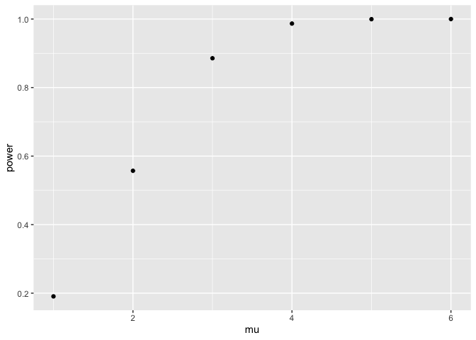
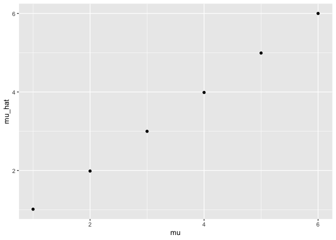
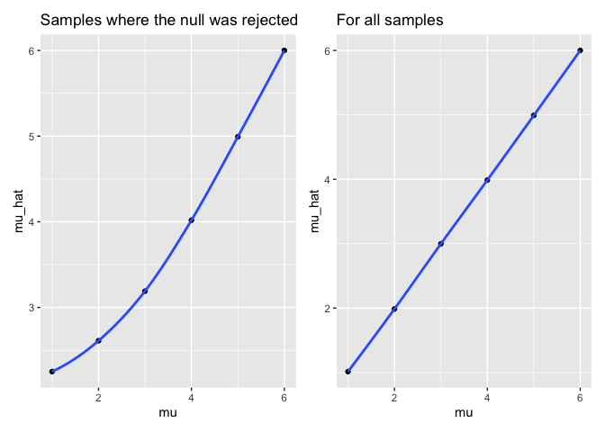
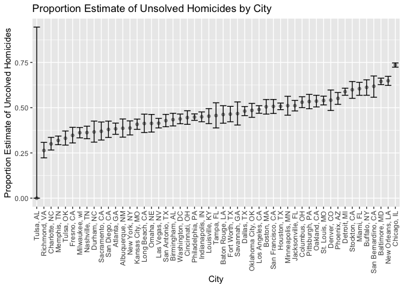

Homework 5: Iteration
================
Kimberly Lopez
2024-11-06

``` r
library(tidyverse)
```

    ## ── Attaching core tidyverse packages ──────────────────────── tidyverse 2.0.0 ──
    ## ✔ dplyr     1.1.4     ✔ readr     2.1.5
    ## ✔ forcats   1.0.0     ✔ stringr   1.5.1
    ## ✔ ggplot2   3.5.1     ✔ tibble    3.2.1
    ## ✔ lubridate 1.9.3     ✔ tidyr     1.3.1
    ## ✔ purrr     1.0.2     
    ## ── Conflicts ────────────────────────────────────────── tidyverse_conflicts() ──
    ## ✖ dplyr::filter() masks stats::filter()
    ## ✖ dplyr::lag()    masks stats::lag()
    ## ℹ Use the conflicted package (<http://conflicted.r-lib.org/>) to force all conflicts to become errors

``` r
library(rvest)
```

    ## 
    ## Attaching package: 'rvest'
    ## 
    ## The following object is masked from 'package:readr':
    ## 
    ##     guess_encoding

``` r
library(broom)
library(dplyr)
library(patchwork)
library(purrr)

set.seed(5)
```

# Problem 1

Birthday problem

For loop across all

Plot the results

# Problem 2

For one randomly generated sample of n=30, with mean = 0, and sd= 5, run
a t.test() and return the estimate & p-value:

``` r
sim_data = 
    tibble(
    x = rnorm (30, mean= 0, sd= 5))

t.test(sim_data)|>
  broom::tidy()|>
  select(estimate,p.value)
```

    ## # A tibble: 1 × 2
    ##   estimate p.value
    ##      <dbl>   <dbl>
    ## 1   0.0565   0.951

Function for performing a one-sample t-test and returning the estimate &
p-value:

``` r
sim_t_test = function ( n , mu= 0, sigma =5) {
  
  sim_data = 
    tibble(
    x = rnorm (n, mean= mu, sd= sigma))
  
  sim_data|>
    t.test()|>
    broom::tidy()|>
    select(estimate, p.value)
  
}

sim_t_test(n=30)
```

    ## # A tibble: 1 × 2
    ##   estimate p.value
    ##      <dbl>   <dbl>
    ## 1    0.794   0.415

For 5000 datasets: when mu=1

``` r
output = vector("list", 5000)

for (i in 1:5000) {
  output[[i]] = sim_t_test(n=30)
}

sim_results_mu1 = bind_rows(output)

head(sim_results_mu1)
```

    ## # A tibble: 6 × 2
    ##   estimate p.value
    ##      <dbl>   <dbl>
    ## 1  -0.584    0.471
    ## 2   0.396    0.686
    ## 3  -0.416    0.667
    ## 4  -0.0730   0.941
    ## 5   1.03     0.158
    ## 6   0.0726   0.946

Function for calculating power: known as the proportion of times the
null was rejected

- Use after binding all simulations

``` r
sim_power = function ( data) {
  
  data|>
   filter(p.value < 0.05) |>
  summarize(
    power = n() / nrow(data), 
    mu = unique(mu))
  
}
```

Function that run the 5000 sample for loop updating mu for mu=
1,2,3,4,5,6

``` r
sim_results=list()

for (mu_val in 1:6) {
  

  output= vector("list", 5000)
  for (i in 1:5000) {
    output[[i]] = sim_t_test(n = 30, mu = mu_val)
  }
  
  sim_results[[mu_val]]= bind_rows(output) |>
    mutate(mu = mu_val)  
}
```

``` r
summary(sim_results)
```

    ##      Length Class  Mode
    ## [1,] 3      tbl_df list
    ## [2,] 3      tbl_df list
    ## [3,] 3      tbl_df list
    ## [4,] 3      tbl_df list
    ## [5,] 3      tbl_df list
    ## [6,] 3      tbl_df list

``` r
output= map_dfr(sim_results, sim_power)|>
  bind_rows()

output 
```

    ## # A tibble: 6 × 2
    ##   power    mu
    ##   <dbl> <int>
    ## 1 0.191     1
    ## 2 0.557     2
    ## 3 0.886     3
    ## 4 0.987     4
    ## 5 1.00      5
    ## 6 1         6

``` r
output|>
  ggplot(aes(x=mu, y = power))+
  geom_point()
```

<!-- -->

The scatter plot of the power of the test associated with a given mu
value increases as mu increases. With a fixed sample size of n=30 and
standard deviation = 5, increasing mu increases the observed power of
the test. This makes sense as the larger values of mu create a greater
difference from the null hypothesis, making it easier to detect a true
effect.

Make a plot showing the average estimate of 𝜇̂ on the y axis and the true
value of 𝜇on the x axis.

``` r
all_mu_hats= 
  sim_results|>
  bind_rows()|>
  group_by(mu)|>
  summarize(
    mu_hat= mean(estimate))|>
  ggplot(aes(x=mu, y=mu_hat))+
  geom_point()

all_mu_hats
```

<!-- -->

Make a second plot (or overlay on the first) the average estimate of 𝜇̂
only in samples for which the null was rejected on the y axis and the
true value of 𝜇on the x axis.

``` r
sim_results|>
  bind_rows()|>
  group_by(mu)|>
  filter(p.value < 0.05) |>
  summarize(
    mu_hat= mean(estimate))|>
  ggplot(aes(x=mu, y=mu_hat))+
  geom_point()+ 
  geom_smooth(se=FALSE)+
  labs(
    title= "Samples where the null was rejected"
  )+
  all_mu_hats+ 
  geom_smooth(se=FALSE)+ 
  labs(
    title= "For all samples")
```

    ## `geom_smooth()` using method = 'loess' and formula = 'y ~ x'
    ## `geom_smooth()` using method = 'loess' and formula = 'y ~ x'

<!-- -->

Is the sample average of 𝜇̂ across tests for which the null is rejected
approximately equal to the true value of 𝜇? Why or why not?

The mu estimate for which the null is reject is not always approximately
equal to the true value of mu when the null is rejected. When the null
is rejected, there is significant evidence that the sample deviates from
the true value of mu under the null hypothesis. As shown by the left
plot, this can lead to a slight overestimation or underestimation of the
true mu value for when mu values are smaller. This may also be due to
the lower power observed among the smaller mu values from plot 1.

# Problem 3

The homicide data is data The Washington Post has gathered data on
homicides in large U.S. cities.

``` r
homicide_data = 
  read.csv("homicide-data.csv")|>
  janitor::clean_names()|>
  mutate(
    reported_date= as.character(reported_date),                  
    reported_date = as.Date(reported_date, format = "%Y%m%d") 
  )
```

The homicide_data is made of 52179 entries, each of which describes a
homicide, and 12 columns. Each entry has data on uid, reported_date,
victim_last, victim_first, victim_race, victim_age, victim_sex, city,
state, lat, lon, disposition. There are 51 cities included where
homicides occurred in the US from 2007 to 2017.

**Although the article mentions 50 cities, the city of Tulsa is counted
twice in unique cities, but there are two cities named Tulsa: one in Ok
and another in AL. When I google Tulsa city in Alabama, another city
comes up spelled ” Tuscaloosa”. I am uncertain if the article counted
all Tulsa city homicides for one state or not. Since the data file has
not specified if the city name was misspelled, I will treat distinct
city by city name and state**

Create a city_state variable(e.g. “Baltimore, MD”) and then summarize
within cities to obtain the total number of homicides and the number and
the number of unsolved homicides (those for which the disposition is
“Closed without arrest” or “Open/No arrest”).

``` r
homicide_data = 
  homicide_data |> 
  mutate(
    city_state = paste(city,state, sep=", "))

homicide_city_stats = 
  homicide_data|>
  group_by(city_state)|>
  summarize( 
    tot_homicides = n(), 
    unsolved_homicides = 
      sum(
      str_detect(disposition, "Closed without arrest") | str_detect(disposition, "Open/No arrest"))
    )

head(homicide_city_stats)
```

    ## # A tibble: 6 × 3
    ##   city_state      tot_homicides unsolved_homicides
    ##   <chr>                   <int>              <int>
    ## 1 Albuquerque, NM           378                146
    ## 2 Atlanta, GA               973                373
    ## 3 Baltimore, MD            2827               1825
    ## 4 Baton Rouge, LA           424                196
    ## 5 Birmingham, AL            800                347
    ## 6 Boston, MA                614                310

The `homicide_city_stats` dataframe has 51 entries, each of which
describes the stats of a city, and 3 columns. Each entry has data on
city_state, tot_homicides, unsolved_homicides.

For the city of Baltimore, MD, use the `prop.test` function to estimate
the proportion of homicides that are unsolved; save the output of
prop.test as an R object, apply the `broom::tidy` to this object and
pull the estimated proportion and confidence intervals from the
resulting tidy dataframe.

``` r
baltimore_data= 
  homicide_city_stats|>
  filter(city_state =="Baltimore, MD")

baltimore_prop_test=
  prop.test(x= as.numeric(baltimore_data[3]), as.numeric(baltimore_data[2]))

baltimore_prop_test|>
  broom::tidy()|>
  select(estimate,conf.low,conf.high)
```

    ## # A tibble: 1 × 3
    ##   estimate conf.low conf.high
    ##      <dbl>    <dbl>     <dbl>
    ## 1    0.646    0.628     0.663

Now run prop.test for each of the cities in your dataset, and extract
both the proportion of unsolved homicides and the confidence interval
for each. Do this within a “tidy” pipeline, making use of purrr::map,
purrr::map2, list columns and unnest as necessary to create a tidy
dataframe with estimated proportions and CIs for each city.

``` r
city_stat_nest= 
  homicide_city_stats|>
  nest( data = tot_homicides:unsolved_homicides)

city_stat_nest|> 
  group_by(city_state)|>
  mutate(
    prop_test = map(data, \(x) prop.test(x= x[["unsolved_homicides"]], n= x[["tot_homicides"]])),
    tidy_results = map(prop_test,broom::tidy))|>
  unnest(tidy_results) |>
  select(estimate, conf.low, conf.high)
```

    ## Warning: There was 1 warning in `mutate()`.
    ## ℹ In argument: `prop_test = map(...)`.
    ## ℹ In group 49: `city_state = "Tulsa, AL"`.
    ## Caused by warning in `prop.test()`:
    ## ! Chi-squared approximation may be incorrect

    ## Adding missing grouping variables: `city_state`

    ## # A tibble: 51 × 4
    ## # Groups:   city_state [51]
    ##    city_state      estimate conf.low conf.high
    ##    <chr>              <dbl>    <dbl>     <dbl>
    ##  1 Albuquerque, NM    0.386    0.337     0.438
    ##  2 Atlanta, GA        0.383    0.353     0.415
    ##  3 Baltimore, MD      0.646    0.628     0.663
    ##  4 Baton Rouge, LA    0.462    0.414     0.511
    ##  5 Birmingham, AL     0.434    0.399     0.469
    ##  6 Boston, MA         0.505    0.465     0.545
    ##  7 Buffalo, NY        0.612    0.569     0.654
    ##  8 Charlotte, NC      0.300    0.266     0.336
    ##  9 Chicago, IL        0.736    0.724     0.747
    ## 10 Cincinnati, OH     0.445    0.408     0.483
    ## # ℹ 41 more rows

Doing the same thing but with function `map2(x, y, .function` instead:

``` r
city_stats= 
  city_stat_nest |>
  group_by(city_state) |>
  mutate(
    prop_test = map2(
      .x = map(data, ~.x[["unsolved_homicides"]]),  
      .y = map(data, ~.x[["tot_homicides"]]),     
      ~prop.test(x = .x, n = .y)),
    tidy_results = map(prop_test, broom::tidy)  ) |>
  unnest(tidy_results) |>
  select(estimate, conf.low, conf.high)
```

    ## Warning: There was 1 warning in `mutate()`.
    ## ℹ In argument: `prop_test = map2(...)`.
    ## ℹ In group 49: `city_state = "Tulsa, AL"`.
    ## Caused by warning in `prop.test()`:
    ## ! Chi-squared approximation may be incorrect

    ## Adding missing grouping variables: `city_state`

``` r
head(city_stats)
```

    ## # A tibble: 6 × 4
    ## # Groups:   city_state [6]
    ##   city_state      estimate conf.low conf.high
    ##   <chr>              <dbl>    <dbl>     <dbl>
    ## 1 Albuquerque, NM    0.386    0.337     0.438
    ## 2 Atlanta, GA        0.383    0.353     0.415
    ## 3 Baltimore, MD      0.646    0.628     0.663
    ## 4 Baton Rouge, LA    0.462    0.414     0.511
    ## 5 Birmingham, AL     0.434    0.399     0.469
    ## 6 Boston, MA         0.505    0.465     0.545

Original for loop method: same results as mapping methods

``` r
city_prop_results = list()


for (city in unique(homicide_city_stats[["city_state"]])){
  
  city_data= 
  homicide_city_stats|>
  filter(city_state ==city)
  
  
  city_prop_test=
  prop.test(x= as.numeric(city_data[["unsolved_homicides"]]),
            n= as.numeric(city_data[["tot_homicides"]]))
  
  city_results= 
    city_prop_test|>
    broom::tidy()|>
    select(estimate, conf.low, conf.high)|>
    mutate(
      city_state= city
    )
  
  city_prop_results[[city]] = city_results
}
```

    ## Warning in prop.test(x = as.numeric(city_data[["unsolved_homicides"]]), :
    ## Chi-squared approximation may be incorrect

``` r
all_cities_results = 
  bind_rows(city_prop_results)|>
  relocate(city_state)

head(all_cities_results)
```

    ## # A tibble: 6 × 4
    ##   city_state      estimate conf.low conf.high
    ##   <chr>              <dbl>    <dbl>     <dbl>
    ## 1 Albuquerque, NM    0.386    0.337     0.438
    ## 2 Atlanta, GA        0.383    0.353     0.415
    ## 3 Baltimore, MD      0.646    0.628     0.663
    ## 4 Baton Rouge, LA    0.462    0.414     0.511
    ## 5 Birmingham, AL     0.434    0.399     0.469
    ## 6 Boston, MA         0.505    0.465     0.545

I first started using a forloop method to create this dataframe, and
then was able to do it using the `purr::map1` method and `purr::map2`
function. I will continue with using the dataframe from the map2
function, but essentially came to create the same dataframes with all 3
methods that show 51 entries, and 4 columns. Each row has data on
city_state, estimate, conf.low, conf.high for all 51 cities.

**Again there are 51 unique cities rather than the 50 reported in the
article based on the city name and state ( there are 2 different “Tulsa”
cities)**

Created a plot that shows the estimates and CIs for each city using
geom_errorbar for a way to add error bars based on the upper and lower
limits.

``` r
city_stats|>
  ggplot(aes(x=reorder(city_state, estimate), y=estimate))+
  geom_point(alpha=.4)+
  geom_errorbar(aes(ymin = conf.low, ymax = conf.high))+
  theme(axis.text.x = element_text(angle = 90, vjust = 0.5, hjust=1))+ 
  labs( title= "Proportion Estimate of Unsolved Homicides by City", 
        x= "City", 
        y="Proportion Estimate of Uncolved Homicides")
```

<!-- -->
